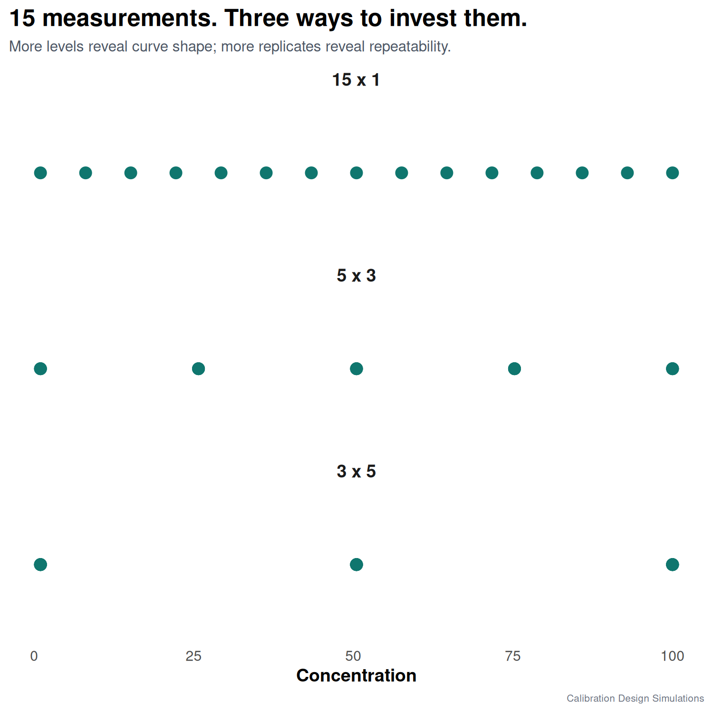

How should we invest 15 calibration measurements?

Calibration is not only a question of how many standards we prepare. It is a question of what we need those standards to teach us.

I simulated a simple case: linear response, constant absolute measurement error, and 15 total calibration measurements. Then I compared three designs:

- 15 levels measured once
- 5 levels measured in triplicate
- 3 levels measured five times

Same budget. Different information.

The 15-level design gives more information about the shape of the calibration line. The replicated designs give more information about repeatability at selected concentrations. Both are useful, but they answer different analytical questions.

This is the point I would like more analysts to discuss before running the experiment: are we trying to estimate a slope, estimate repeatability, check linearity, or support uncertainty around unknown samples?

A calibration design is not just a regulatory checkbox. It is an experimental-design choice.

In the next step I looked at what happens when the response remains linear, but the variance is no longer constant. That is where the usual OLS calibration starts to become less comfortable.

#AnalyticalChemistry #Chemometrics #RStats #Calibration

