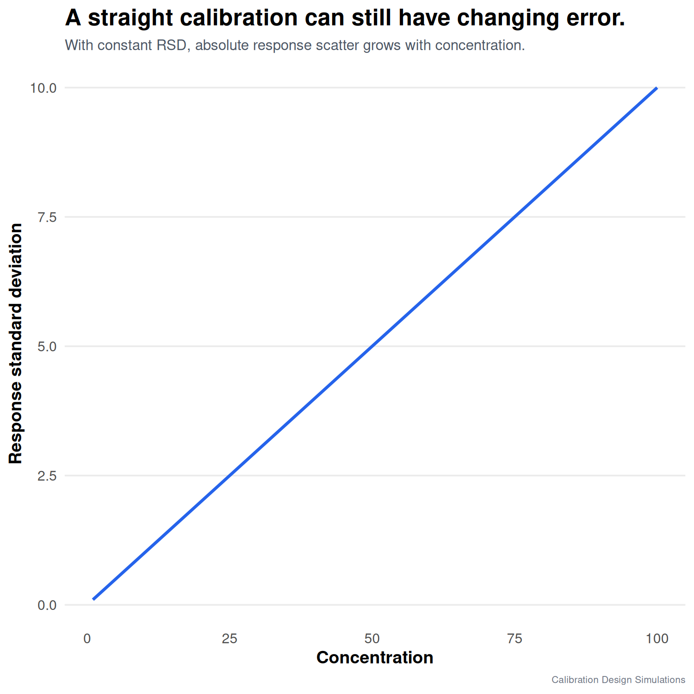

A calibration curve can be linear and still have a statistical problem.

The hidden assumption behind ordinary least squares is not only that the mean response is linear. It is also that the response variability is approximately constant across the range.

Many analytical methods do not behave like that. At higher concentrations, the absolute signal scatter can increase even when the relative precision is acceptable.

That is heteroscedasticity.

In a simulation with constant RSD, the calibration line still looked linear. But the residual spread increased with concentration. This matters because OLS treats all residuals as equally informative. A large residual at high concentration may simply be expected measurement variability, while a smaller residual at low concentration may be analytically more important.

This is why residual plots are not decorative. They are part of understanding the measurement process.

For me, the practical question is not only: “is the calibration linear?”

It is also: “are all calibration points equally precise?”

If the answer is no, weighted least squares may be more appropriate, but only if the weights reflect the real variance pattern.

#AnalyticalChemistry #Chemometrics #Calibration #RStats

