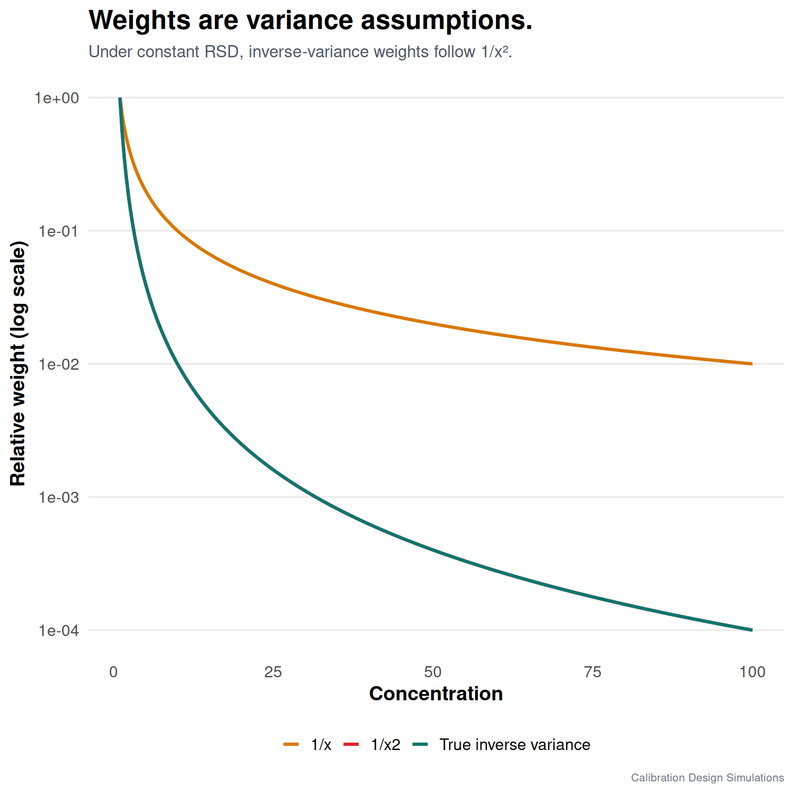

Weighted least squares is not a magic upgrade from ordinary least squares.

It is a way of saying: some calibration points are measured more precisely than others, and the regression should know that.

If a method has approximately constant relative standard deviation, the absolute standard deviation increases with concentration. In that case, inverse-variance weighting often makes sense. This is why analytical chemists often see weights like 1/x or 1/x².

But these are not just formulas. They are assumptions about the measurement process.

In my simulation, 1/x² behaved well when the data really had constant RSD. That is expected because variance is then roughly proportional to concentration squared.

The important part is the word “when”.

Using 1/x² because it is familiar is not the same as showing that the method has that variance structure. Empirical weights can help, but only if the calibration design includes enough replicated levels to estimate variance. In this simulation, 3 levels measured 5 times is a sensible routine design because it gives repeatability information at low, middle, and high concentration.

WLS is useful only when its weights describe the method's real variability. The advantage of replicated levels is simple: they let us estimate and check that variability rather than taking a familiar weighting rule on faith.

This is where design and statistics meet. If we want to estimate precision from calibration data, we need replicates. If we want to describe curve shape, we need levels.

Same injections. Different information.

#AnalyticalChemistry #Chemometrics #RStats #WeightedLeastSquares

