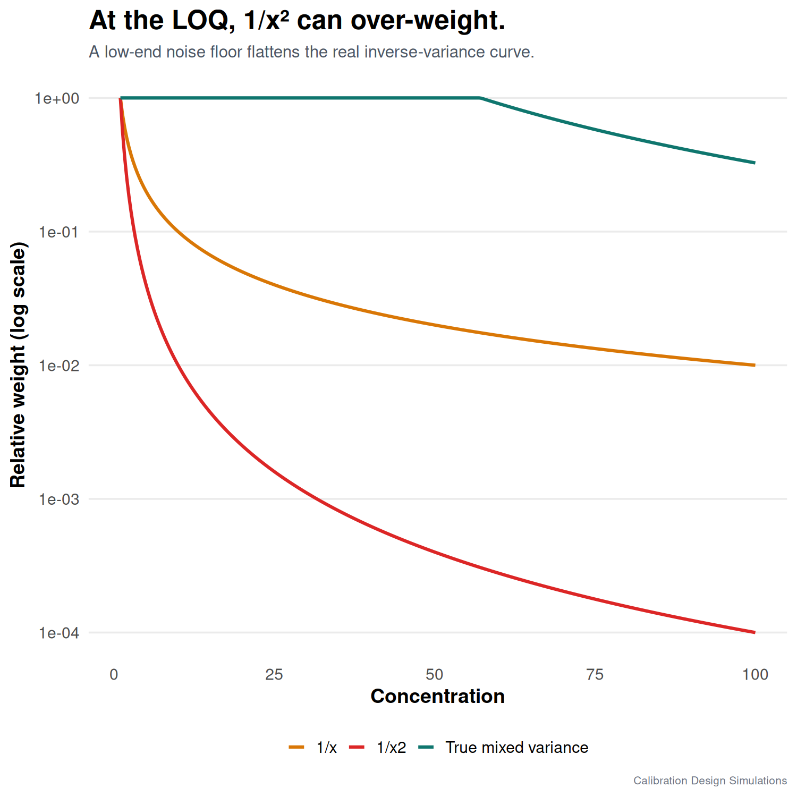

Simple weighting rules can fail exactly where analytical chemists care most: near the LOQ.

A clean constant-RSD assumption says that variance keeps decreasing as concentration decreases. Under that assumption, 1/x² weighting is reasonable.

But near the low end, many methods have a noise floor. Blank variability, integration noise, and background correction do not vanish just because the concentration is small.

So the real variance pattern may be mixed:

- constant absolute error near the LOQ
- approximately constant relative error farther from the LOQ

In that situation, a global 1/x² weight can give too much influence to the lowest calibration points. Those points may not be as precise as the weight function assumes.

The fitted line can still look acceptable. The problem shows up in low-level prediction error and interval coverage. Coverage means the fraction of true concentrations captured by a nominal 95% prediction interval; it should be near 95%, without buying that result with implausibly wide intervals.

My practical takeaway: do not judge weighting only by the global calibration plot or by R². Look at residuals, low-level recovery, replicate behavior, and uncertainty by concentration region.

Weights should describe the method, not decorate the regression.

In this mixed-error simulation, global RMSE differences can be small because every model has the right linear mean and the mismatch is concentrated near the LOQ. That is why I would choose based on low-level recovery, coverage, and replicate evidence rather than a tiny global RMSE difference. After validation, 3 x 5 with variance estimated from the replicates is my preferred routine option: it is more auditable than assuming 1/x², while still being compact.

#AnalyticalChemistry #LOQ #Chemometrics #RStats

