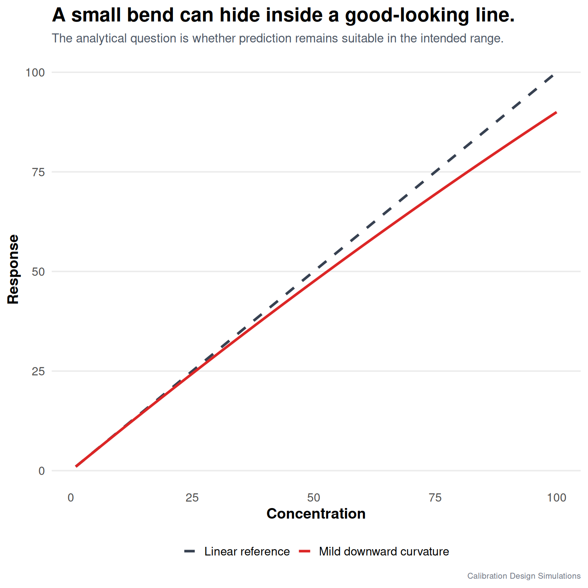

In chemical calibration, non-linearity usually bends downward.

It often looks like the beginning of saturation: the signal still increases with concentration, but the slope starts to decrease. If we force a straight line through that response, high-level samples can become biased.

I simulated a mild downward curvature and compared the same 15-measurement designs:

- 15 levels measured once
- 5 levels measured in triplicate
- 3 levels measured five times

For the deliberately slight curvature in this simulation, no 15-measurement design came close to 95% power. All can occasionally find a bend, but none can reliably identify it. A non-significant result should not be treated as proof of linearity.

Replicates are excellent for estimating precision at selected levels. But they do not create information between levels. If the analytical question is “is the response really linear?”, then the number and placement of concentration levels are critical.

This is the trade-off I keep coming back to: calibration design depends on the question.

Want repeatability? Use replicates.

Want shape information? Use levels across the range.

Want both? Then the design has to admit that both goals need measurement budget.

Does this matter if prediction error remains suitable? Yes—but the decision is practical. A linear model may be acceptable inside its validated range if bias, prediction error, and interval coverage meet acceptance criteria. Curvature still matters because error can grow at the range edge or when conditions change.

Linearity is not proven by a nice-looking straight line through too few levels. For validation, I would use many well-distributed levels plus replication; the compact 3 x 5 approach makes more sense later, for routine monitoring after the shape has been established.

#AnalyticalChemistry #Chemometrics #Calibration #RStats

